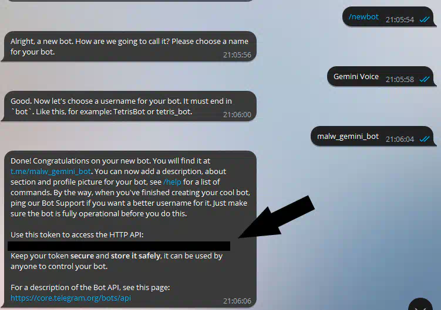

# Gemini пересказывает все голосовые сообщения, которые вам приходят​ в Telegram
## Возможность подключить этого бота к аккаунту есть только у Premium пользователей! Но использовать его, пересылая ГС боту можно и без Premium.

Это уже скриншоты уже в моём ЛС с людьми:

# Бота можно хостить только на нероссийских серверах: API Gemini нельзя использовать с ру айпи!
### Для установки:
1. Заполняем конфиг:

**gemini_token** — API ключ Gemini. Получать тут: https://aistudio.google.com/app/apikey

Для этого:
1. Включаем ВПН (или Comss DNS): https://notmalwa
2. Заходим на AI Studio
3. Create API Key
4. В окне с полем поиска тыкаем кнопку выше поля. Копируем ключ.

**bot_token** — токен бота Telegram. https://t.me/botfather

**allowed_users** — список [ID пользователей, которые смогут привязать бота к бизнесу, либо использовать его в ЛС с ботом] и [ID чатов, в котором бот будет автоматически распознавать все ГС]. Для определения ID используйте https://t.me/myidbot.

2. Включаем **Business Mode** в BotFather

3. Идём в настройки ТГ -> Telegram для бизнеса -> Чат-боты. Вставляем ссылку на своего бота.

4. Всё, ждём голосовых сообщений!